Embeber un CollectionView en un TableViewCell - Swift
===

<p align="center">
  
</p>

## XIB

### TableViewController

1. Creamos un TableViewController con su XIB (Xcode Interface Builder) o NIB (NextStep Interface Builder) correspondiente. Nota. XIB o NIB son lo mismo.

<p align="center">
  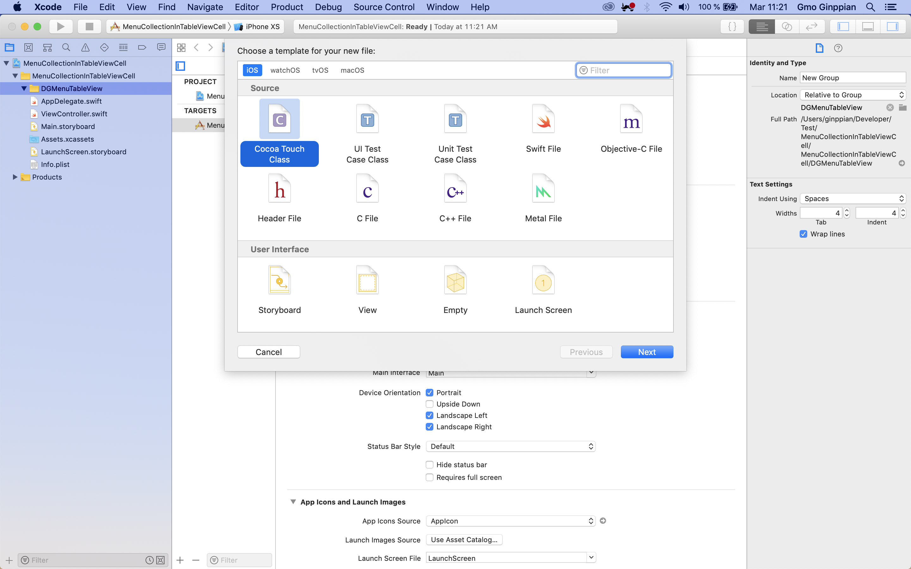
</p>

<p align="center">
  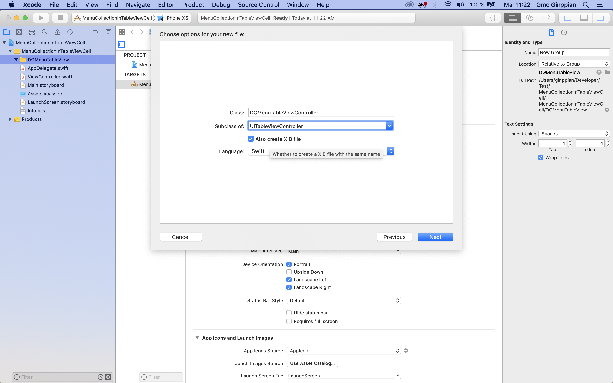
</p>

2. Y una celda un TableViewCell

<p align="center">
  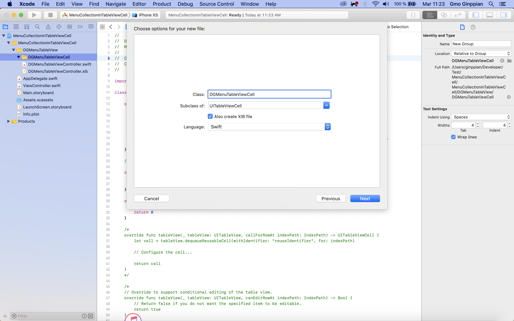
</p>


3. En la TableViewController registramos nuestra celda. Previo a eso debemos poner un <i>identifier</i> a nuestra celda, a través de el InterfaceBuilder lo recomendable es poner el nombre de la xib o de la classe para facilitar. Nota. Agregar los elementos correspondientes a la celda y hacer los outlets correspondientes en su clase.

<p align="center">
  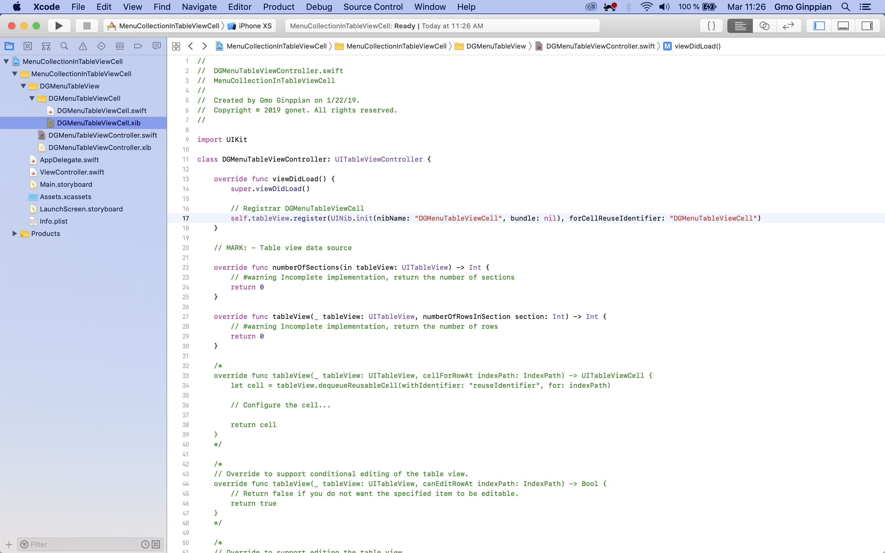
</p>

4. Como creamos un componente que hereda de UITableViewController por defecto ya viene asociado con los protocolos <i>DataSource y Delegate</i> y hay que sobreescribir las funciones de estos protocolos <i>(override)</i>.

<p align="center">
  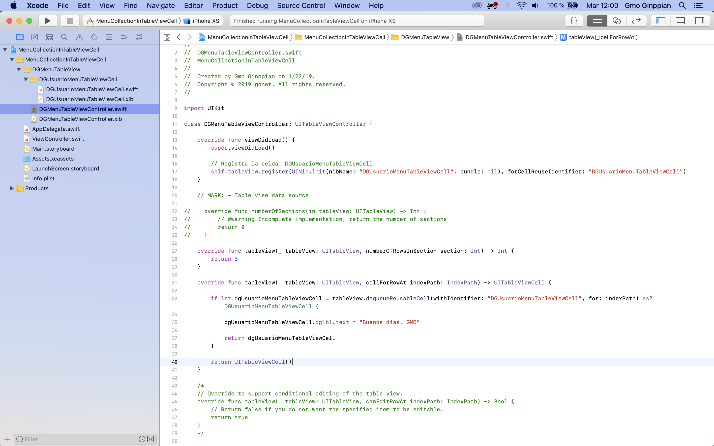
</p>

Nota. En caso de que nos otros creemos un ViewController vacio y agreguemos un UITableView tendremos que hacer <i>control+drag</i> de nuestro tableView hacia 
nuestro <i>Files's Owner</i> ahí podremos ligarlo a los protocolos, después hacer un outlet a nuestro Controller y nombrarlo como <i>tableView</i> y en el viewDidload de nuestro Controller bastara con poner algo como:

```swift
self.tableView.dataSource = self
self.tableView.delegate = self
```

Ahora sí ya podremos, instanciar nuestra tabla y hacerle present o push en nuestro flujo de navegación.

Nota 2. Si vamos a mandar a llamar la tabla desde un viewController nuestro viewController tiene que estar atadoa un flujo de navegación como un UINavigation o un UITabBar, sino lo esta hagamoslo.

<p align="center">
  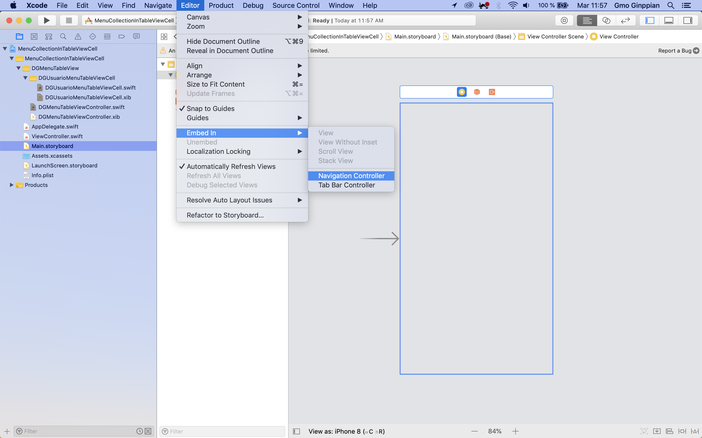
</p>

Nota 3. En caso de que nos otros queramos lanzarla como vista principal y manejar todo con xib, tendremos que hacerlo dedsde el appDelegate en el didFinish:

``swift
        let nav1 = UINavigationController()
        let mainView = DGMenuTableViewController()
        nav1.viewControllers = [mainView]
        self.window!.rootViewController = nav1
        self.window?.makeKeyAndVisible()
```

Nota 4. Si queremos pasarle parametros a nuestra Tabla cuando la instanciemos. Tendremos que poner un constructor por conveniencia, algo como:

```swift
    convenience init(give name: String, give identifier: String) {
        self.init()
        self.name = name
        self.identifier = identifier
    }
```

y mandarlo a llamar de la misma manera, y funcionará igual, sólo que pasandole esos parametros.

### Collection embebed in TableViewCell

1. Bueno ahora, tendremos que emebeber el collection en nuestra tableViewCell, así que arrastramos un UICollectionView a nuestro canvas de nuestra UItableViewCell. 
A su vez este collection tendrá cellCollections y unos protocolos con funciones que manejen estas cellCollections, todo esto lo haremos dentro del controlador de UITableViewCell.

<p align="center">
  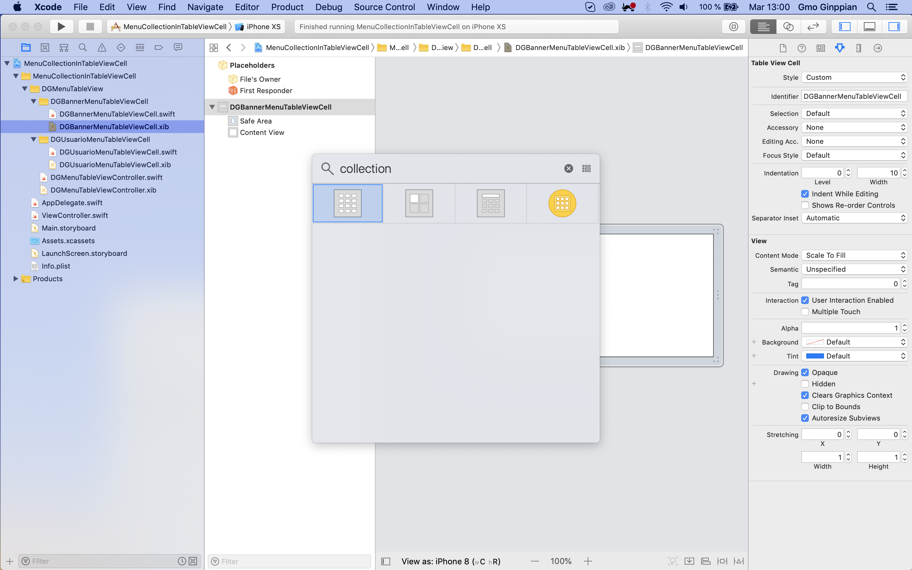
</p>

<p align="center">
  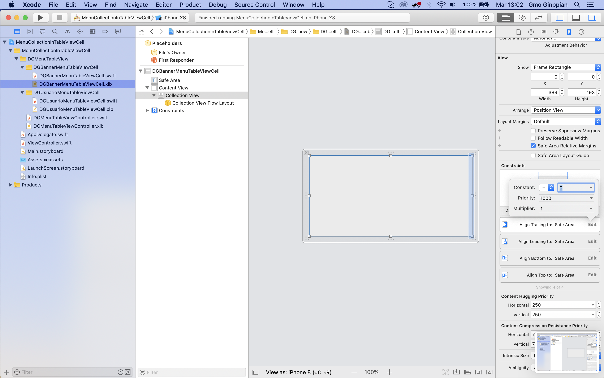
</p>

2. Hacemos el outlet de nuestro elemento collection a nuestro controller.

<p align="center">
  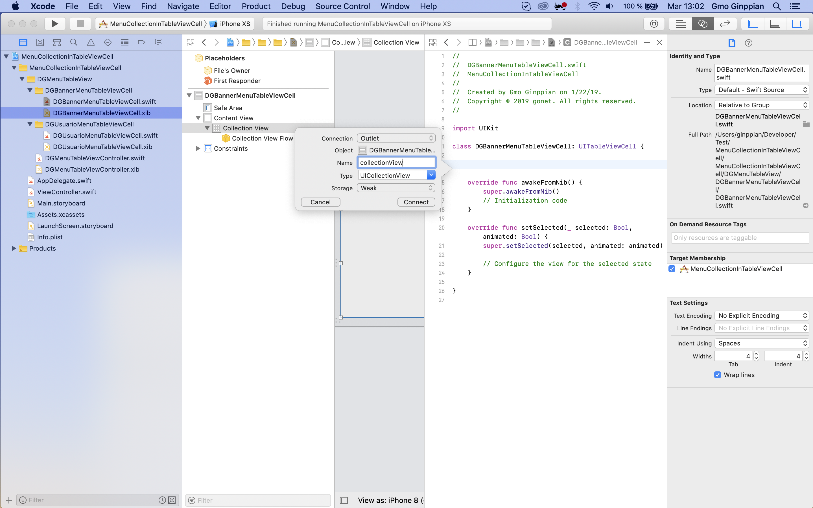
</p>

3. Hacemos <i>control+drag</i> a nuestro File's Owner para asociarlo con nuestro DataSource y Delegate.

<p align="center">
  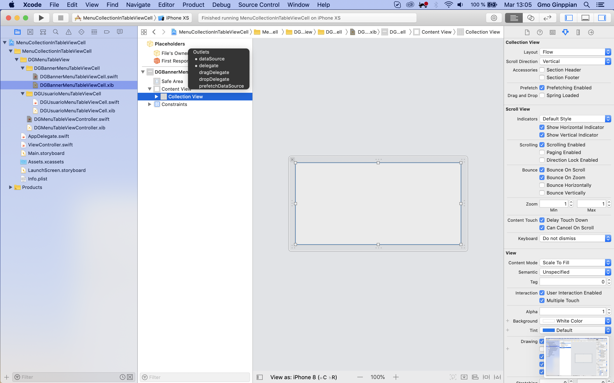
</p>

4. En el awakFromNib (algo como viewDidLoad) del controlador de nuestra celda lo assignamos como delegado de dataSource y de Ddelegate.

Nota. Tambien tendremos que poner el flujo que seguira (horizontal o vertical), para que compile correctamente.

<p align="center">
  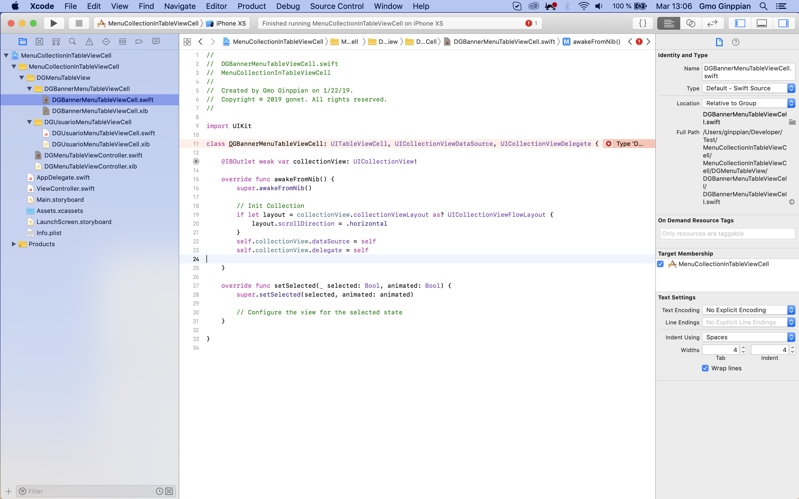
</p>

5. Ahora creamos una celda de Collection

<p align="center">
  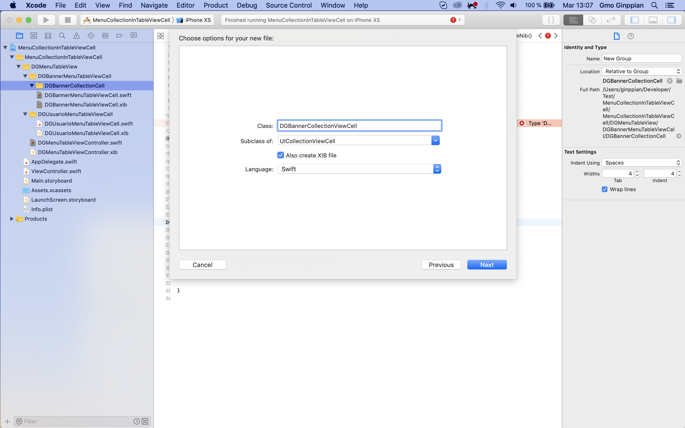
</p>

6. Ponemos componentes, constraints, asignamos outlets a nuestro controlador.

Nota 2. Agregamos un identificador para la celda del collection. Recomendable poner el mismo nombre del xib o de nuestro controller.

<p align="center">
  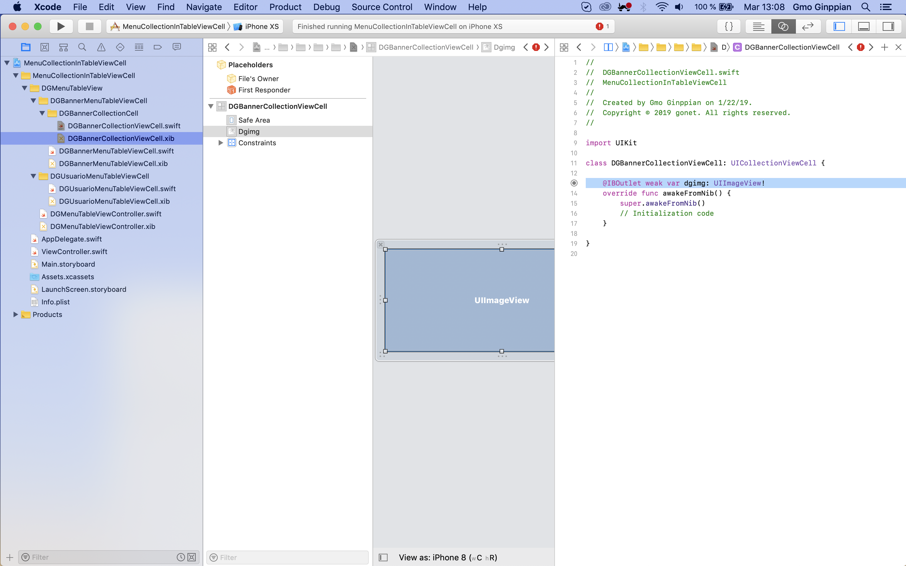
</p>

7. Registramos la celda.

<p align="center">
  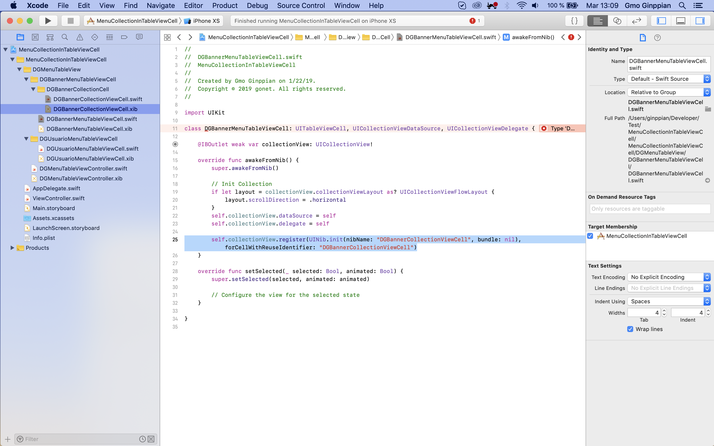
</p>

8. Completamos las funciones de nuestros protocolos.

Nota 3. Para DelegateFlowLayout que contiene el metodo sizeForItem que nos permite asignar un tamaño a una celda, en nuestro caso no lo reconocía hasta que se puso como una extension. De esta manera también se puede usar.

<p align="center">
  
</p>

Al correr debe mostrarnos el scroll vertical de la tabla y el scroll horizontal de los collection.

## Fuentes

1. <a href="https://medium.com/@aestusLabs/adding-a-uicollectionviews-to-a-custom-uitableviewcell-xib-tutorial-swift-4-xcode-9-2-1ec9ce4095d3">Adding A UICollectionViews To A Custom UITableViewCell Xib Tutorial(Swift 4 Xcode 9.2)</a>

2. <a href="https://ashfurrow.com/blog/putting-a-uicollectionview-in-a-uitableviewcell-in-swift/">Putting a UICollectionView in a UITableViewCell in Swift</a>


